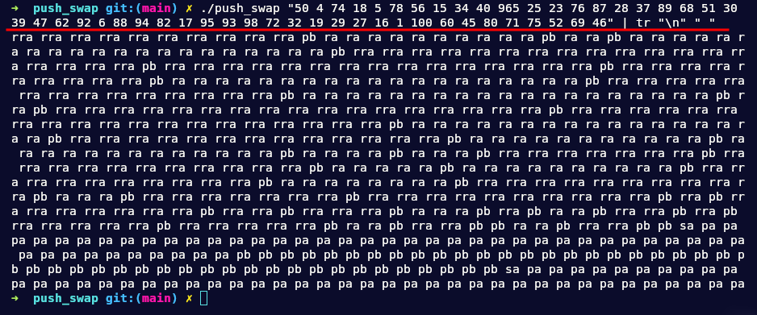

# push_swap

This project involves sorting data on a stack, with a limited set of instructions, and the smallest number of moves.

## Tehnologies

## Restrictions

- There is a set of integer values, 2 stacks, and a set of instructions to manipulate both stacks.
- Write a program in C called push_swap which calculates and displays
on the standard output the smallest program, made of Push swap language instructions,
that sorts the integers received as arguments.
-  The stack a contains a random amount of negative and/or positive numbers which cannot be duplicated.
- The goal is to sort in ascending order numbers into stack a.

## Instructions in push_swap

- `sa`  (swap a): Swap the first 2 elements at the top of stack a.
Do nothing if there is only one or no elements.
- `sb` (swap b): Swap the first 2 elements at the top of stack b.
Do nothing if there is only one or no elements.
- `ss` : sa and sb at the same time.
- `pa` (push a): Take the first element at the top of b and put it at the top of a.
Do nothing if b is empty.
- `pb` (push b): Take the first element at the top of a and put it at the top of b.
Do nothing if a is empty.
- `ra` (rotate a): Shift up all elements of stack a by 1.
The first element becomes the last one.
- `rb` (rotate b): Shift up all elements of stack b by 1.
The first element becomes the last one.
- `rr` : ra and rb at the same time.
- `rra` (reverse rotate a): Shift down all elements of stack a by 1.
The last element becomes the first one.
- `rrb` (reverse rotate b): Shift down all elements of stack b by 1.
The last element becomes the first one.
- `rrr` : rra and rrb at the same time.

## Screenshots

